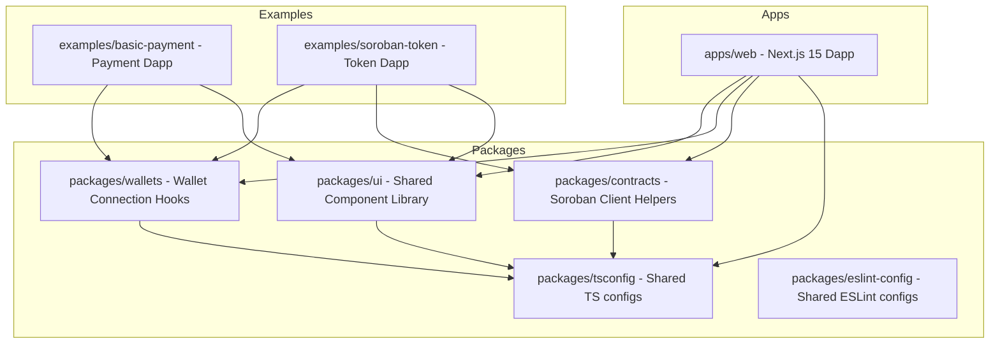

# Architecture Specification

This document details the architectural design and structural choices for `stellar-starter-kit`.

---

## Monorepo Architecture

We structure this codebase as a monorepo using **pnpm workspaces** and **Turborepo** to ensure high modularity, shared configuration, rapid development cycles, and cached builds.

---

## Folder Responsibilities

### `/apps`

Contains deployable applications.

- **`apps/web`**: The main entry point. A Next.js 15 app showcasing wallet connections, contract interactions, transaction building, and the component catalog.

### `/contracts`

Contains the Soroban Rust smart contract workspace.

- **`contracts/counter`**: Flagship production-grade reference implementation containing modular business logic, instance storage TTL bumps, customized error structures, events emission, and comprehensive testing blocks.
- **`contracts/escrow`**: Flagship secure escrow implementation supporting multi-party agreement lifecycles (create, fund, release, refund, cancel), status transitions, deadline enforcement, event publishing, and thorough test cases.

### `/packages`

Contains internal, highly reusable library packages.

- **`packages/wallets`**: Aggregates Stellar wallets (Freighter, Albedo, Rabet, Hana) under a unified React Context and React Hook.
- **`packages/contracts`**: Contains generated Soroban TypeScript bindings, helper hooks, and client wrappers to interact with deployed WASM smart contracts.
- **`packages/ui`**: Component library containing custom tailwind-styled shadcn/ui components customized for Stellar interactions (wallet buttons, transaction status indicators).
- **`packages/tsconfig`**: Houses base TypeScript configuration files inherited by other packages and apps.
- **`packages/eslint-config`**: Houses base ESLint configurations to maintain code standards across workspaces.

### `/examples`

Independent starter templates demonstrating focused use cases.

- **`examples/basic-payment`**: Minimal demo showing how to send XLM or custom assets between accounts.
- **`examples/soroban-token`**: Full example demonstrating how to upload a custom token, mint, transfer, and read contract state.

### `/docs`

Developer documentation, deployment guides, security policies, and architectural RFCs.

### `/public`

Global assets, images, and public configuration templates.

### `/scripts`

Utility scripts for local environment setups, contract generation, and automated tasks.

---

## Key Design Principles

1.  **Strict Modularity**: Wallet APIs should never depend on UI styling. Application views should interact with hooks and abstract clients.
2.  **No Placeholders**: We build actual, working interfaces, rather than mocks, ensuring a developer can deploy directly to Mainnet or Testnet immediately.
3.  **Fast Iteration Cycle**: Turborepo manages parallel builds and only rebuilds workspace layers that have active changes, speeding up local developer cycles and CI/CD pipelines.
4.  **Optimal User Experience**: Every page supports dark mode, loads fast, is fully typed, and provides clear visual cues for transaction loading and ledger synchronization.
