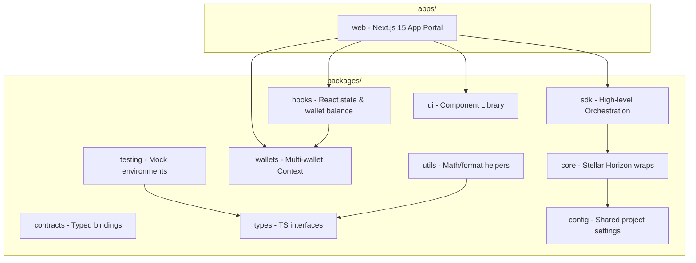
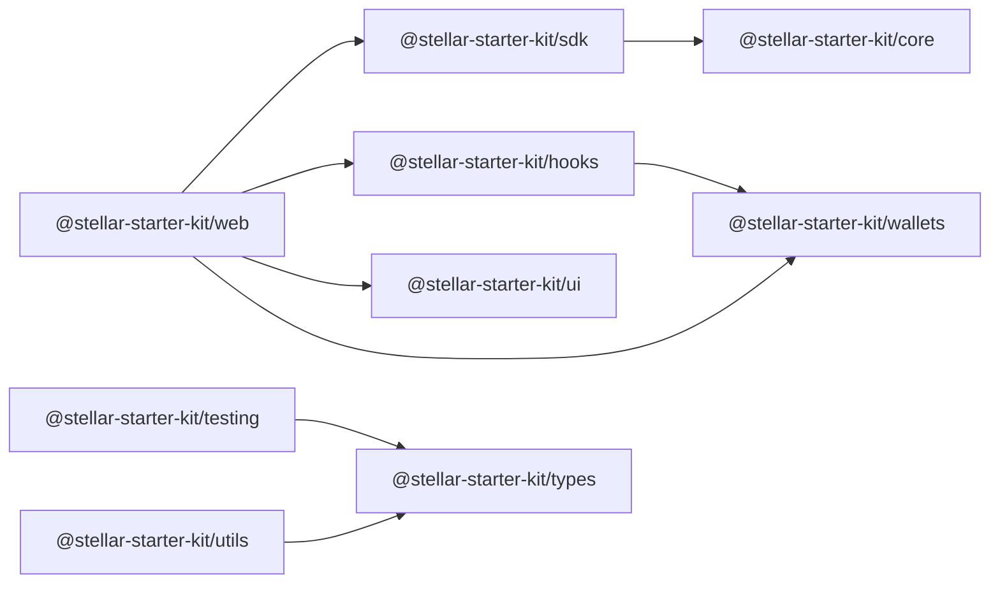
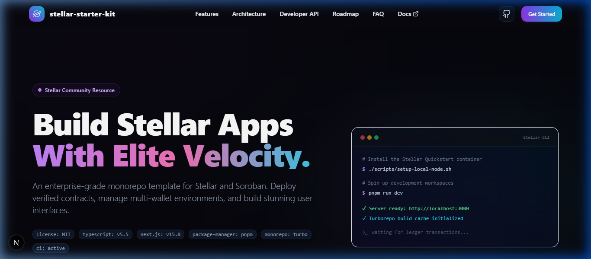
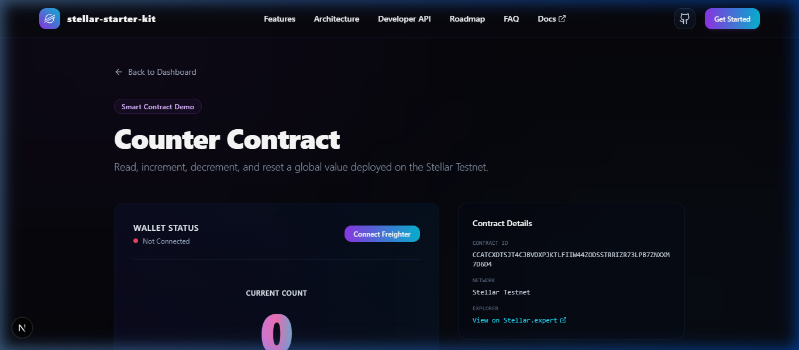

# 🌌 Stellar Starter Kit

<div align="center">


**The fastest way to build, test, and deploy modern Stellar and Soroban applications.**

[](https://github.com/SorobanForge/stellar-starter-kit/actions)
[](LICENSE)
[](https://nextjs.org)
[](https://typescriptlang.org)
[](CONTRIBUTING.md)

</div>

---

## 🎯 Why This Project Exists...

Scaffolding Stellar and Soroban applications historically required developers to manually orchestrate multiple disconnected tooling systems: client libraries, custom wallet adapter wrappers, smart contract bindings, environment setups, and testing frameworks.

`stellar-starter-kit` resolves these friction points by providing a pre-configured, production-ready **monorepo template**. It establishes immediate compile-safe bindings between contract interfaces, React frontend states, unit tests, and multi-wallet providers, allowing developers to go from zero to a live mainnet dApp in minutes.

---

## ⚖️ Comparison with Alternatives

| Feature / Tool             |        `stellar-starter-kit`         | Manual SDK Scaffolding | Standard React templates |
| :------------------------- | :----------------------------------: | :--------------------: | :----------------------: |
| **Monorepo Ready**         |        **Yes** (pnpm + Turbo)        |           No           |            No            |
| **Pre-configured Wallets** | **Yes** (Freighter/Albedo/Rabe/Hana) |           No           |            No            |
| **Soroban Bindings Sync**  |               **Yes**                |         Manual         |            No            |
| **Conventional Commits**   |     **Yes** (Commitlint + Husky)     |           No           |            No            |
| **Automated Releases**     |         **Yes** (Changesets)         |           No           |            No            |
| **Shared Styling System**  |      **Yes** (Cosmic Theme CSS)      |           No           |            No            |

---

## 📐 Architecture & Dependency Diagrams

### Project Architecture Flow



### Monorepo Workspaces Dependency Graph



---

## 📂 Folder Structure

```
stellar-starter-kit/
├── .changeset/              # Version release configurations (Changesets)
├── .github/                 # GitHub pipelines and templates
│   ├── workflows/           # CI, PR and Release Actions
│   └── ISSUE_TEMPLATE/      # Custom GitHub issues templates
├── apps/                    # Next.js applications
│   └── web/                 # Next.js 15 dashboard portal
├── packages/                # Shared workspace modular libraries
│   ├── cli/                 # Command line tools for code generation
│   ├── config/              # Shared constants & build configurations
│   ├── contracts/           # Smart contract configurations
│   ├── core/                # Raw Horizon & RPC SDK client wraps
│   ├── hooks/               # Custom React hooks (wallet balance, etc.)
│   ├── sdk/                 # Standard Client SDK API endpoint exports
│   ├── testing/             # Test mocking libraries & simulators
│   ├── types/               # Common TypeScript interface types
│   ├── ui/                  # Components library (Shadcn + Framer Motion)
│   ├── utils/               # Math, unit converters and address formatters
│   └── wallets/             # Unified wallet connectivity context
└── examples/                # Quickstart tutorials
    └── basic-payment/       # CLI Stellar XLM Payment builder demo
```

---

## 🖼️ Application Showcase

### 1. Main Dashboard

<div align="center">
  
  <p><em>Cosmic Dapp Interface Dashboard Preview</em></p>
</div>

### 2. Counter Smart Contract Dashboard

<div align="center">
  
  <p><em>Interact with Soroban smart contracts directly from the UI with real-time transaction logs and state synchronization.</em></p>
</div>

---

## 🚀 Quick Start

### 1. Installation

Clone the repository and install dependencies using pnpm:

```bash
git clone https://github.com/SorobanForge/stellar-starter-kit.git
cd stellar-starter-kit
pnpm install
```

### 2. Configure Environment Variables

Copy the env template file and update configurations:

```bash
cp .env.example .env.local
```

### 3. Spin Up Local Node

Start a local standalone Quickstart Docker node for development:

- **Using pnpm (Recommended)**:
  ```bash
  pnpm run node:local
  ```
- **Windows (PowerShell)**:
  ```powershell
  ./scripts/setup-local-node.ps1
  ```
- **macOS / Linux (Bash)**:
  ```bash
  ./scripts/setup-local-node.sh
  ```
- **Direct Docker Compose**:
  ```bash
  docker compose up -d
  ```

_(To stop the local node at any time, run `docker compose down`)_

### 4. Start Development Server

Build and run the next.js dashboard portal:

```bash
pnpm run dev
```

Navigate to [http://localhost:3000](http://localhost:3000).

### 5. Smart Contract Workflow

You can compile, optimize, deploy, and invoke our flagship Counter smart contract on-chain using:

```bash
# Build Rust workspace contracts to WASM
pnpm build:contracts

# Optimize WASM binaries for minimum gas size
pnpm optimize

# Deploy to Stellar Testnet and generate typed TypeScript client bindings
pnpm deploy:counter

# Verify execution by invoking on-chain
pnpm invoke:counter
```

### 🌐 Active Testnet Deployment Details

Our reference smart contract is actively deployed on **Stellar Testnet**:

- **Contract ID**: `CCH5B5TFLLN56KB4B762CA2IVX4MYRDDMYXDYIEITCXYIGMIEMLWWCSF`
- **Stellar.expert Explorer**: [View Contract Details](https://stellar.expert/explorer/testnet/contract/CCH5B5TFLLN56KB4B762CA2IVX4MYRDDMYXDYIEITCXYIGMIEMLWWCSF)
- **WASM Upload Transaction**: [Explorer Link](https://stellar.expert/explorer/testnet/tx/f75b79a3f1d8c196886b2a21dfc8947720b44b354ba14396dc67cd00d6f2be63)
- **Contract Deploy Transaction**: [Explorer Link](https://stellar.expert/explorer/testnet/tx/933f41945e44434c25ed4300439f63da758621ac2eefee787818cee9f9b446bc)

---

## 💻 Baseline Usage Examples

### Formatting address display using `@stellar-starter-kit/utils`

```typescript
import { formatAddress, formatStroopsToXlm } from '@stellar-starter-kit/utils';

const displayKey = formatAddress('GD3W5PQLX6Y6S7WLMCP6UFRT4N4IELKJD3X54V5A7LNLNEQ5Z6L4HJK3');
// GD3W...HJK3

const balanceXlm = formatStroopsToXlm(10000000);
// "1"
```

### Orchestrating operations via `@stellar-starter-kit/sdk`

```typescript
import { StellarClient } from '@stellar-starter-kit/sdk';

const client = new StellarClient('https://horizon-testnet.stellar.org');
const server = client.getServer();
```

---

## 📖 API Documentation Reference

The kit exposes these primary modular namespaces:

- **`@stellar-starter-kit/sdk`**: `StellarClient` class to retrieve Horizon Servers.
- **`@stellar-starter-kit/utils`**: `formatAddress(address: string, chars?: number): string` and `formatStroopsToXlm(stroops: string | number | bigint): string`.
- **`@stellar-starter-kit/hooks`**: `useStellarNetworkStatus(): boolean` tracking connection properties.
- **`@stellar-starter-kit/testing`**: `createMockAccount(): { publicKey: string, secret: string }` for test run mocks.

---

## ❓ FAQ

#### How do I add a new smart contract client?

Compile your Soroban Rust contract to WASM, then run `soroban contract bindings typescript` pointing to the WASM file, and save the resulting files inside `packages/contracts`.

#### How does semantic versioning and release work?

The repository uses Changesets. When making a pull request, run `pnpm changeset` to generate a markdown version patch configuration. Once merged to `main`, GitHub Actions auto-versions the packages and publishes releases.

#### Does this template support mainnet operations?

Yes. The network passphrase, Horizon API, and Soroban RPC URL are fully configurable in `.env.local`.

---

## 🗺️ Roadmap & Milestones

- **v0.1**: Scaffold Monorepo workspace layouts, Next.js 15 dashboard, and mock test coverage.
- **v0.2**: Integrate wallet adapter hooks (`useWallet`) for Freighter, Albedo, Hana, and Rabe.
- **v0.5**: Smart contracts compiler templates and auto-generated bindings pipeline.
- **v1.0**: Production audit checks, multi-network switch layouts, and sandbox testing.

---

## 🤝 Contributing

Contributions of any size are welcome! Please review the [CONTRIBUTING.md](CONTRIBUTING.md) guide and the [Code of Conduct](CODE_OF_CONDUCT.md) before submitting pull requests.

---

## 📄 License

Distributed under the MIT License. See [LICENSE](LICENSE) for more details.
