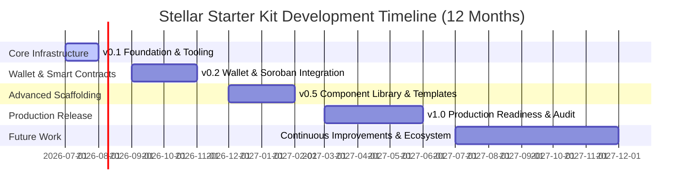

# Stellar Starter Kit Roadmap

This roadmap outlines the milestones and timeline for the development of `stellar-starter-kit` over the next 12 months.

---

## Roadmap Overview

---

## Milestones

### :seedling: v0.1: Foundation & Tooling (Months 1–2)

_Focus: Monorepo configuration, developer environments, and initial scaffolding._

- [x] Configure pnpm workspace and Turborepo.
- [x] Setup Next.js 15, TypeScript, TailwindCSS, and shadcn/ui.
- [x] Configure ESLint, Prettier, Husky, and Conventional Commits.
- [x] Build basic Docker dev environment and Stellar Quickstart setup script.
- [x] Create basic documentation site template.

### :wallet: v0.2: Wallet & Soroban Integration (Months 3–5)

_Focus: Key wallet integrations and smart contract deployment tooling._

- [x] Implement `@stellar-starter-kit/wallets` package.
  - [x] Connect with Freighter wallet.
  - [x] Connect with Albedo, Rabet, and Hana wallets.
  - [ ] Support WalletConnect for mobile wallets.
- [x] Scaffolding and hooks for Soroban smart contract interactions.
  - [x] Automatic type generation helper from WASM files.
  - [x] Custom React hooks for contract state retrieval.
  - [x] Custom hooks for invoking transactions.
- [ ] Live network/contract switching UI component.

### :sparkles: v0.5: Component Library & Examples (Months 6–8)

_Focus: Interactive UI components, dapp examples, and design system._

- [ ] Core Stellar UI component kit in `packages/ui` (shadcn-based).
  - [ ] Wallet Connection button and dropdown (shows balances, network, recent txs).
  - [ ] Asset amount inputs with balance checking.
  - [ ] Explorer transaction links and success/error toasts.
- [ ] Deploy multiple examples:
  - [ ] `examples/basic-payment`: Simple peer-to-peer asset transfer.
  - [ ] `examples/soroban-token`: Deploying, minting, and transfering Soroban tokens.
  - [ ] `examples/liquidity-pool`: Interacting with AMM and liquidity pools.

### :rocket: v1.0: Production Readiness & Audits (Months 9–12)

_Focus: Security, rigorous testing, complete documentation, and stable release._

- [ ] Conduct third-party security audits of packages.
- [ ] Establish 95%+ unit test coverage for packages and hooks.
- [ ] Publish production deployment guides (Vercel, AWS, Netlify).
- [ ] Finalize standard API design and freeze breaking changes.
- [ ] Official v1.0.0 release.

---

## Future Release Ideas

- [ ] **Cross-chain bridges integration**: Scaffolding for bridging assets to/from Stellar.
- [ ] **Stellar Anchor Platform integration**: Scaffolding for SEP-24 (deposit/withdraw) and SEP-10 (web auth).
- [ ] **Mobile SDK**: React Native starter templates with the same shared hooks.
